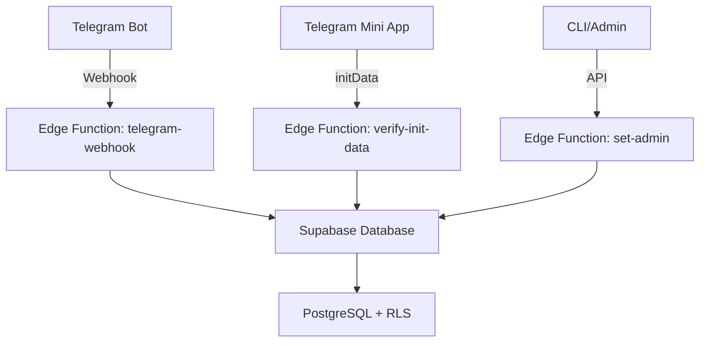

# 🚀 Инструкция по Развертыванию Telegram Mini App "Лицей №1"

## 📋 Содержание
1. [Общая Архитектура](#общая-архитектура)
2. [Предварительные Требования](#предварительные-требования)
3. [Развертывание на Lovable Cloud (Supabase)](#развертывание-на-lovable-cloud-supabase)
4. [Развертывание на Self-Hosted Supabase](#развертывание-на-self-hosted-supabase)
5. [Настройка Telegram Бота](#настройка-telegram-бота)
6. [CLI Команды](#cli-команды)
7. [Безопасность](#безопасность)
8. [Troubleshooting](#troubleshooting)

---

## 🏗️ Общая Архитектура

Система состоит из трех основных компонентов:



**Компоненты:**
- **Telegram Bot**: Обрабатывает команды пользователей через webhook
- **Telegram Mini App**: React веб-приложение с верификацией через initData
- **Edge Functions**: Serverless API для бизнес-логики
- **PostgreSQL**: База данных с Row-Level Security (RLS)

---

## 📦 Предварительные Требования

### 1. Telegram Bot Token
1. Создайте бота через [@BotFather](https://t.me/botfather)
2. Получите токен бота (формат: `1234567890:ABCdefGHIjklMNOpqrsTUVwxyz`)
3. Настройте команды бота:
```
start - Начать работу
help - Список команд
webapp - Открыть веб-приложение
schedule - Расписание
courses - Спецкурсы
profile - Мой профиль
```

### 2. Инструменты разработки
- Node.js 18+ или Deno 1.37+
- Git
- curl или Postman (для тестирования API)

---

## ☁️ Развертывание на Lovable Cloud (Supabase)

### Шаг 1: Публикация Проекта
1. Откройте проект в Lovable
2. Нажмите **"Publish"** в правом верхнем углу
3. Дождитесь развертывания (Edge Functions и фронтенд)
4. Скопируйте URL проекта (например: `https://your-project.lovable.app`)

### Шаг 2: Настройка Секретов
Все секреты уже добавлены в Lovable Cloud:
- ✅ `TELEGRAM_BOT_TOKEN` - токен вашего Telegram бота
- ✅ `SUPABASE_URL` - автоматически настроен
- ✅ `SUPABASE_SERVICE_ROLE_KEY` - автоматически настроен

**Дополнительный секрет для безопасности CLI:**
1. Перейдите в **Settings → Cloud → Secrets**
2. Добавьте секрет:
   - Name: `ADMIN_SECRET_KEY`
   - Value: Сгенерируйте случайную строку (например: `openssl rand -hex 32`)

### Шаг 3: Получение URL Edge Functions
После публикации Edge Functions доступны по адресам:
```
https://yffdyyjugrzyqdvtjnho.supabase.co/functions/v1/telegram-webhook
https://yffdyyjugrzyqdvtjnho.supabase.co/functions/v1/verify-init-data
https://yffdyyjugrzyqdvtjnho.supabase.co/functions/v1/set-admin
```

### Шаг 4: Настройка Webhook для Telegram
```bash
curl -X POST https://api.telegram.org/bot<YOUR_BOT_TOKEN>/setWebhook \
  -H "Content-Type: application/json" \
  -d '{
    "url": "https://yffdyyjugrzyqdvtjnho.supabase.co/functions/v1/telegram-webhook",
    "allowed_updates": ["message", "callback_query"]
  }'
```

**Проверка webhook:**
```bash
curl https://api.telegram.org/bot<YOUR_BOT_TOKEN>/getWebhookInfo
```

Должен вернуться JSON с `url` и `has_custom_certificate: false`.

---

## 🔧 Развертывание на Self-Hosted Supabase

### Шаг 1: Установка Supabase CLI
```bash
# macOS/Linux
brew install supabase/tap/supabase

# Windows (Scoop)
scoop bucket add supabase https://github.com/supabase/scoop-bucket.git
scoop install supabase

# NPM (все платформы)
npm install -g supabase
```

### Шаг 2: Инициализация Проекта
```bash
# Клонируйте репозиторий
git clone <your-repo-url>
cd lyceum1-telegram-app

# Инициализация Supabase
supabase init

# Создайте файл .env
cat > .env << EOF
TELEGRAM_BOT_TOKEN=your_bot_token_here
ADMIN_SECRET_KEY=$(openssl rand -hex 32)
EOF
```

### Шаг 3: Запуск Локально
```bash
# Запуск Supabase локально
supabase start

# Применить миграции
supabase db reset

# Запустить Edge Functions локально
supabase functions serve
```

**Локальные URL:**
```
API: http://localhost:54321
Studio: http://localhost:54323
Edge Functions: http://localhost:54321/functions/v1/
```

### Шаг 4: Развертывание на Продакшн
```bash
# Подключение к проекту Supabase
supabase link --project-ref <your-project-ref>

# Применить миграции
supabase db push

# Развернуть Edge Functions
supabase functions deploy telegram-webhook
supabase functions deploy verify-init-data
supabase functions deploy set-admin

# Установить секреты
supabase secrets set TELEGRAM_BOT_TOKEN=<your_bot_token>
supabase secrets set ADMIN_SECRET_KEY=<your_admin_secret>
```

### Шаг 5: Развертывание Фронтенда
```bash
# Установка зависимостей
npm install

# Сборка для продакшн
npm run build

# Развертывание (выберите платформу)
# Vercel:
vercel --prod

# Netlify:
netlify deploy --prod

# Или используйте Lovable Publish
```

---

## 🤖 Настройка Telegram Бота

### 1. Настройка Web App
В [@BotFather](https://t.me/botfather):
```
/newapp
# Выберите вашего бота
# Укажите URL: https://your-project.lovable.app
# Загрузите иконку и описание
```

### 2. Настройка Меню Бота
```
/setcommands
# Выберите вашего бота
# Вставьте команды:
start - Начать работу с ботом
help - Показать список всех команд
webapp - Открыть веб-приложение
schedule - Посмотреть расписание
courses - Просмотр спецкурсов
profile - Мой профиль
```

### 3. Тестирование Бота
1. Откройте чат с ботом в Telegram
2. Отправьте `/start`
3. Нажмите на кнопку меню → `/webapp`
4. Откроется Telegram Mini App

---

## 🛠️ CLI Команды

### Создание Первого Администратора

#### Вариант 1: Для веб-админ-панели (рекомендуется)

**Через Node.js скрипт:**
```bash
node cli-create-first-admin.js admin SecurePassword123! "Главный Администратор"
```

Скрипт запросит `ADMIN_SECRET_KEY`, который вы установили в настройках проекта.

После успешного создания войдите в админ-панель:
- **URL**: `https://your-project.lovable.app/admin/login`
- **Username**: `admin`
- **Password**: `SecurePassword123!`

**Через curl:**
```bash
curl -X POST https://yffdyyjugrzyqdvtjnho.supabase.co/functions/v1/create-admin \
  -H "Content-Type: application/json" \
  -d '{
    "username": "admin",
    "password": "SecurePassword123!",
    "full_name": "Главный Администратор",
    "secret_key": "your-super-secret-admin-key"
  }'
```

#### Вариант 2: Назначение роли admin пользователю Telegram

**Через Node.js скрипт:**
```bash
node cli-set-admin.js 123456789
```

**Как узнать свой Telegram ID:**
1. Напишите боту [@userinfobot](https://t.me/userinfobot)
2. Скопируйте значение `Id`

**Через curl:**
```bash
curl -X POST https://yffdyyjugrzyqdvtjnho.supabase.co/functions/v1/set-admin \
  -H "Content-Type: application/json" \
  -d '{
    "telegram_id": 123456789,
    "secret_key": "your-super-secret-admin-key"
  }'
```

### Проверка Статуса
```bash
# Проверка логов Edge Function
supabase functions logs set-admin --tail

# Проверка пользователей в базе
psql $DATABASE_URL -c "SELECT p.telegram_id, p.first_name, ur.role FROM profiles p LEFT JOIN user_roles ur ON p.id = ur.user_id;"
```

---

## 🔒 Безопасность

### 1. Верификация Telegram initData
Все запросы от Mini App проходят криптографическую проверку:
```typescript
// Автоматическая верификация в verify-init-data Edge Function
const userData = await verifyTelegramWebAppData(initData, botToken);
```

**Важно:**
- ❌ Никогда не доверяйте данным напрямую из клиента
- ✅ Всегда используйте `verify-init-data` перед доступом к API
- ✅ RLS политики защищают данные на уровне БД

### 2. Row-Level Security (RLS)
Все таблицы защищены RLS политиками:
```sql
-- Пример: только владелец может редактировать свой профиль
CREATE POLICY "Users can update own profile"
  ON profiles FOR UPDATE
  USING (auth.uid() = id);

-- Пример: только админы могут управлять ролями
CREATE POLICY "Admins can manage roles"
  ON user_roles FOR ALL
  USING (public.has_role(auth.uid(), 'admin'));
```

### 3. Секреты
**Никогда не храните секреты в коде!**
- ✅ Используйте Supabase Secrets (автоматически в Lovable Cloud)
- ✅ Для локальной разработки используйте `.env` (добавьте в `.gitignore`)
- ❌ Не коммитьте токены в Git

### 4. HTTPS Only
- Все API запросы должны идти через HTTPS
- Telegram Webhook требует HTTPS
- Mini App работает только через HTTPS

---

## 🐛 Troubleshooting

### Проблема: Webhook не работает
**Решение:**
```bash
# 1. Проверьте статус webhook
curl https://api.telegram.org/bot<TOKEN>/getWebhookInfo

# 2. Проверьте логи Edge Function
# В Lovable: Cloud → Functions → telegram-webhook → Logs

# 3. Удалите и переустановите webhook
curl -X POST https://api.telegram.org/bot<TOKEN>/deleteWebhook
curl -X POST https://api.telegram.org/bot<TOKEN>/setWebhook \
  -d url=https://yffdyyjugrzyqdvtjnho.supabase.co/functions/v1/telegram-webhook
```

### Проблема: initData верификация не проходит
**Решение:**
- Убедитесь, что `TELEGRAM_BOT_TOKEN` правильно установлен
- Проверьте, что Mini App открывается через Telegram (не через браузер)
- Проверьте логи `verify-init-data` функции

### Проблема: Пользователь не может войти
**Решение:**
1. Проверьте, что пользователь прошел через `/start` в боте
2. Проверьте таблицу `profiles`:
```sql
SELECT * FROM profiles WHERE telegram_id = <TELEGRAM_ID>;
```
3. Если профиля нет, используйте CLI для создания

### Проблема: RLS блокирует запросы
**Решение:**
```sql
-- Проверьте политики RLS
SELECT * FROM pg_policies WHERE tablename = '<table_name>';

-- Временно отключите RLS для теста (НЕ НА ПРОДЕ!)
ALTER TABLE <table_name> DISABLE ROW LEVEL SECURITY;
```

---

## 📚 Дополнительные Ресурсы

- [Документация Lovable Cloud](https://docs.lovable.dev/features/cloud)
- [Telegram Bot API](https://core.telegram.org/bots/api)
- [Telegram Mini Apps](https://core.telegram.org/bots/webapps)
- [Supabase Documentation](https://supabase.com/docs)
- [Supabase Edge Functions](https://supabase.com/docs/guides/functions)

---

## 🎉 Готово!

Теперь ваша система "Лицей №1" полностью развернута и готова к использованию. 

**Следующие шаги:**
1. Назначьте первого администратора через CLI
2. Войдите в Mini App и настройте классы
3. Добавьте учителей, учеников и родителей
4. Загрузите расписание
5. Создайте спецкурсы и тесты

Удачи! 🚀
